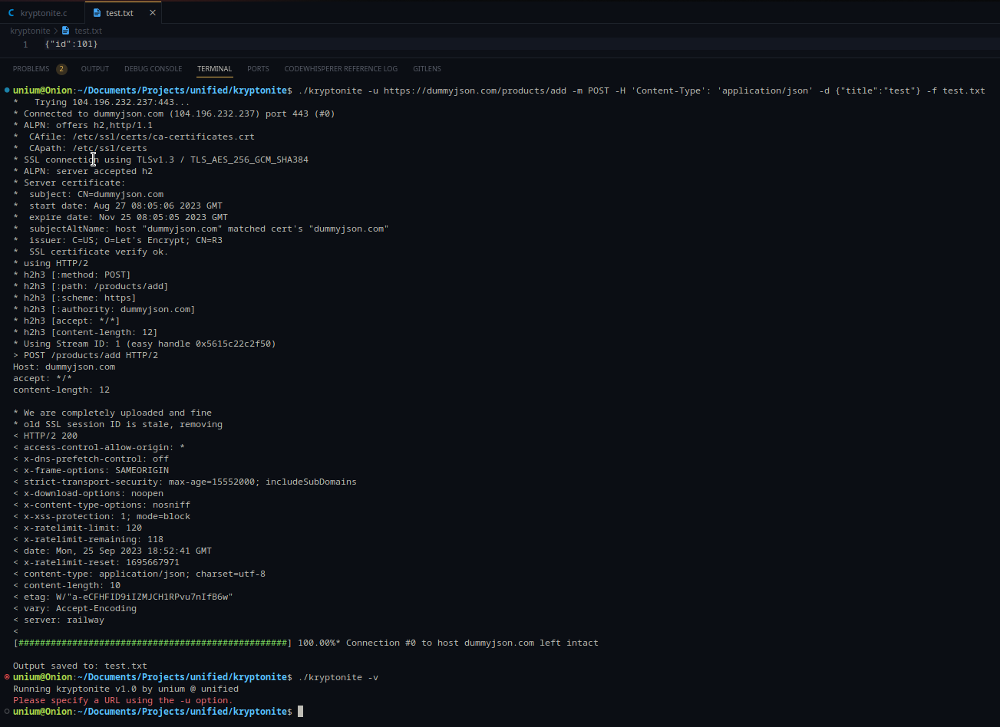

# kryptonite
A simple cURL client, made for fun in a few hours :)
| Options    | Output                                    |
| ---------- | ----------------------------------------- |
| -h         | Displays the help menu                    |
| -v         | Displays the version of ls2.              |
| -u         | URL to be cURL'd.                         |
| -f         | Output file path.                         |
| -m         | HTTP method.                              |
| -d         | POST data.                                |
| -H         | Header(s).                                |
| -c         | Certificate path.                         |



# How to install
## Debian
You can find the latest [debian binary over here](https://github.com/unifiedorg/kryptonite/releases/latest), and install it by running
```
sudo dpkg -i kryptonite_1.9_amd64.deb
```

## Manually building
You can manually build by :

**1st) Installing GCC & libcurl**
```
sudo apt-get update
sudo apt-get install build-essential libcurl4-openssl-dev
```

**2nd) Building the kryptonite.c file**
```
gcc -o kryptonite ./src/kryptonite.c -lcurl
```

**3rd) Moving the kryptonite executable to bin**
```
sudo mv ./kryptonite /usr/local/bin/kryptonite
```

# Contributing
Want to contribute? Check out [CONTRIBUTING.md](./CONTRIBUTING.md)

# Contributers
Maintainer & Creator - TheUnium
